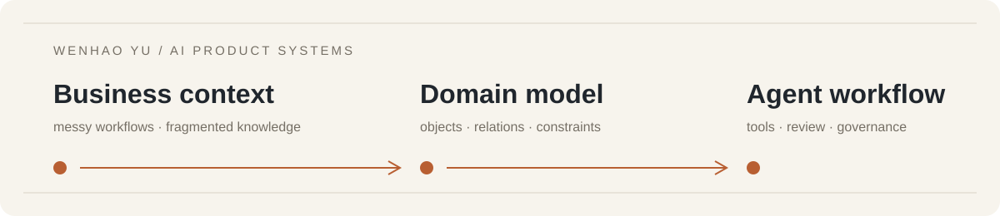

  <picture>
    <source media="(prefers-color-scheme: dark)" srcset="./assets/profile-banner-dark.svg" />
    <source media="(prefers-color-scheme: light)" srcset="./assets/profile-banner-light.svg" />
    
  </picture>
  <h1>Wenhao Yu · Bryan</h1>
  
<strong>AI Product Manager building agent systems for industrial and B2B work</strong>

  

    <a href="https://wenhaoyu-bryan.github.io/">website</a> ·
    <a href="https://wenhaoyu-bryan.github.io/projects/">projects</a> ·
    <a href="https://wenhaoyu-bryan.github.io/about/manifesto/">how I build</a> ·
    <a href="https://wenhaoyu-bryan.github.io/now/">now</a> ·
    <a href="https://www.linkedin.com/in/wenhaoyu-bryan/">LinkedIn</a> ·
    <a href="https://x.com/WENHAOYU8">X</a>
  

  
🟢 Currently exploring: governed agent systems · ontology-driven products · AI-native delivery

> I work in the space between messy business problems, domain models, and working software. I turn ambiguous workflows and fragmented knowledge into products people can test, govern, and use.

<table>
  <tr>
    <td width="50%" valign="top">
      <strong>Current focus</strong> 
      Enterprise agent platforms for advanced manufacturing, with reusable skills, approval gates, sandboxing, and auditable runs.
    </td>
    <td width="50%" valign="top">
      <strong>What I share here</strong> 
      Working prototypes, experiments, and reusable artifacts from building AI products in public.
    </td>
  </tr>
</table>

## Areas I explore

- **Agent systems**: tools, memory, reusable skills, human review, and governance
- **Ontology-driven products**: knowledge graphs and structured models that make enterprise AI operational
- **AI-native delivery**: harness engineering, loop engineering, and AI-assisted prototyping
- **Industrial and B2B AI**: translating domain expertise, workflows, and data constraints into usable software

## Principles I build by

A few principles guide what I build:

- **Model before prompting**: define objects, relationships, constraints, and actions before asking an agent to build
- **Prototype the boundary**: make permissions, failure states, and human review visible early
- **Ship inspectable artifacts**: prefer working demos, traces, methods, and clear notes over claims

## How I work

<strong>Frame the problem</strong> → <strong>Model the domain</strong> → <strong>Prototype the workflow</strong> → <strong>Verify the boundary</strong>

I use AI coding agents to shorten the distance between product intent and a testable prototype. I keep the product decisions explicit: the domain model, constraints, acceptance criteria, and human review points.

## On this profile

GitHub is my public workspace for experiments, working prototypes, and reusable artifacts. My [personal website](https://wenhaoyu-bryan.github.io/) holds the longer case studies, current work, methods, and writing. Some professional details stay abstracted to protect confidential data and systems.

[Projects](https://wenhaoyu-bryan.github.io/projects/) · [Work](https://wenhaoyu-bryan.github.io/work/) · [How I Build](https://wenhaoyu-bryan.github.io/about/manifesto/) · [Now](https://wenhaoyu-bryan.github.io/now/) · [中文介绍](https://wenhaoyu-bryan.github.io/zh/about/)

## Connect

If you are working on industrial AI, agent governance, ontology systems, or AI-native product delivery, [send me a note](mailto:wenhaoyu.bryan@gmail.com).
